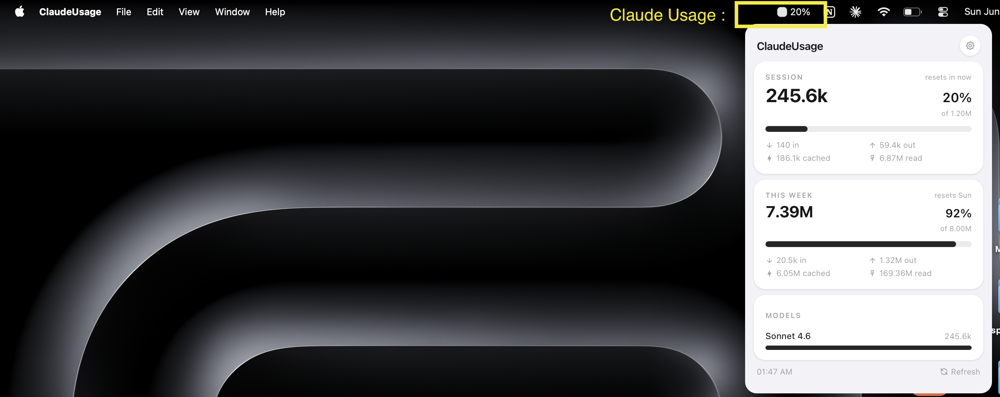

# ClaudeUsage

A macOS menu bar app that shows live Claude Code token usage — session window, weekly totals, per-model breakdown — parsed directly from Claude Code's local JSONL transcript files.

Built with **Tauri v2 + Rust** backend and **React + TypeScript + Tailwind** frontend.



---

## Features

- **Live session tracking** — rolling 5-hour window matching Anthropic's rate-limit bucket
- **Weekly totals** — rolling 7-day window with reset countdown
- **Per-model breakdown** — Sonnet, Haiku, Opus usage side by side
- **Token detail rows** — input / output / cache creation / cache read shown separately
- **Plan percentage bars** — see exactly how much of your Pro or Max quota is used
- **Tray badge** — glanceable token count or percentage in the menu bar at all times
- **Auto-refresh on open** — fetches fresh data every time you click the tray icon
- **Configurable poll interval** — 10s / 30s / 1m / 5m

---

## Prerequisites

| Tool | Install |
|------|---------|
| **Rust** | `curl --proto '=https' --tlsv1.2 -sSf https://sh.rustup.rs \| sh` |
| **Bun** | `curl -fsSL https://bun.sh/install \| bash` |
| **Xcode CLI tools** | `xcode-select --install` |

After installing Rust, add the macOS targets:
```bash
rustup target add aarch64-apple-darwin x86_64-apple-darwin
```

---

## Setup

```bash
# 1. Install JS dependencies
bun install

# 2. Generate placeholder icons (requires Pillow: pip install Pillow)
python3 scripts/create-icons.py

# 3. (Optional) Generate full icon set from the placeholder
bun run tauri:icon src-tauri/icons/app-icon.png
```

---

## Development

```bash
bun run tauri dev
```

Changes to `src/` hot-reload via Vite. Rust changes restart the Tauri process.

---

## Build

```bash
# Universal binary (Apple Silicon + Intel)
bun run tauri:build
```

Output: `src-tauri/target/universal-apple-darwin/release/bundle/macos/ClaudeUsage.app`

---

## How it works

### Data source

Claude Code writes conversation transcripts as JSONL files under:
- `~/.claude/projects/**/*.jsonl`
- `~/.config/claude/projects/**/*.jsonl` (older installs)

Each line with `"type": "assistant"` carries a `message.usage` block:
```json
{
  "type": "assistant",
  "timestamp": "2025-06-12T10:30:00.000Z",
  "message": {
    "id": "msg_abc123",
    "model": "claude-sonnet-4-6",
    "usage": {
      "input_tokens": 1234,
      "output_tokens": 567,
      "cache_creation_input_tokens": 8900,
      "cache_read_input_tokens": 45000,
      "cache_creation": {
        "ephemeral_5m_input_tokens": 4000,
        "ephemeral_1h_input_tokens": 4900
      }
    }
  }
}
```

Newer Claude Code versions split cache creation into time-bucketed fields (`ephemeral_5m_input_tokens` + `ephemeral_1h_input_tokens`). Both formats are handled automatically.

### Token counting

Only **input + output + cache creation** tokens count toward Anthropic's rate limit. Cache read tokens are excluded from the total and percentage calculation — they are cheap context pulls and do not consume quota. They are still shown in the detail row for visibility.

Duplicate messages (same `message.id` appearing in multiple files) are deduplicated, preferring the non-sidechain copy.

### Session windows

| Window | Duration | "Resets in" meaning |
|--------|----------|---------------------|
| Session | Rolling 5 hours | Time until the oldest entry in the window falls off |
| Weekly | Rolling 7 days | Time until the oldest weekly entry falls off |

### Plan limits

Approximate limits stored in `src-tauri/src/settings.rs`. These match observed behaviour — update the constants if Anthropic changes plan limits. Custom per-session and per-week limits can also be set in the Settings panel.

| Plan | Session (5h) | Weekly (7d) |
|------|-------------|-------------|
| Claude Pro | ~1.2M tokens | ~8M tokens |
| Claude Max 5× | ~6M tokens | ~40M tokens |
| Claude Max 20× | ~24M tokens | ~160M tokens |

### Performance

Files are only re-parsed when their mtime or size has changed since the last scan. Unchanged files use an in-memory cache, keeping scans fast even with hundreds of JSONL files.

---

## Installation (for users)

1. Download the `.dmg` file
2. Open the `.dmg` and drag **ClaudeUsage.app** into your `/Applications` folder
3. On first launch macOS may block the app with *"cannot be opened because Apple cannot check it for malicious software"*

**To bypass Gatekeeper:**

- Right-click the app → **Open** → **Open** again in the dialog, or
- Run this once in Terminal:
  ```bash
  xattr -cr /Applications/ClaudeUsage.app
  ```

Then open the app normally. The warning won't appear again.

---

## Settings

| Setting | Description |
|---------|-------------|
| **Subscription Plan** | Sets the limit used for percentage bars. Select your Claude plan. |
| **Refresh Interval** | How often the background poller rescans files and updates the tray badge (10s / 30s / 1m / 5m). |
| **Launch at Login** | Registers the app as a login item via macOS LaunchAgent. |
| **Custom Limits** | Override session/weekly token limits (available when plan is set to "No limit tracking"). |

The panel also fetches fresh data immediately every time you open it (window focus), so you always see current numbers without waiting for the next poll.

---

## Project structure

```
├── src/                        React + TypeScript frontend
│   ├── App.tsx                 Root component — panel / settings toggle, header
│   ├── components/
│   │   ├── TrayPanel.tsx       Main usage panel (session, weekly, models, footer)
│   │   ├── ProgressBar.tsx     Percentage bar
│   │   ├── ModelBreakdown.tsx  Per-model token bars
│   │   └── SettingsPanel.tsx   Plan, refresh, login, custom limits
│   ├── hooks/
│   │   ├── useUsageData.ts     Polls Rust backend; re-fetches on window focus
│   │   └── useSettings.ts      Loads/saves settings via Tauri invoke
│   └── types/usage.ts          Shared TypeScript types
└── src-tauri/
    ├── src/
    │   ├── main.rs             Tauri setup, tray icon, window positioning, blur dismiss
    │   ├── usage_parser.rs     JSONL scanning, parsing, deduplication
    │   ├── session.rs          5-hour / 7-day aggregation, model breakdown, tray badge
    │   ├── pricing.rs          Per-model USD pricing constants
    │   └── settings.rs         Plan limits, persistence (~/.local/share/ClaudeUsage/)
    └── tauri.conf.json         LSUIElement=true (no Dock icon), frameless transparent window
```

---

## Pricing reference

Token costs in `src-tauri/src/pricing.rs` — update if Anthropic changes pricing.

| Model | Input | Output | Cache write | Cache read |
|-------|-------|--------|-------------|------------|
| Opus | $15/MTok | $75/MTok | $18.75/MTok | $1.50/MTok |
| Sonnet | $3/MTok | $15/MTok | $3.75/MTok | $0.30/MTok |
| Haiku | $0.80/MTok | $4/MTok | $1.00/MTok | $0.08/MTok |
